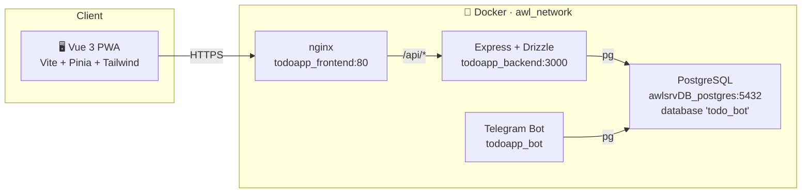
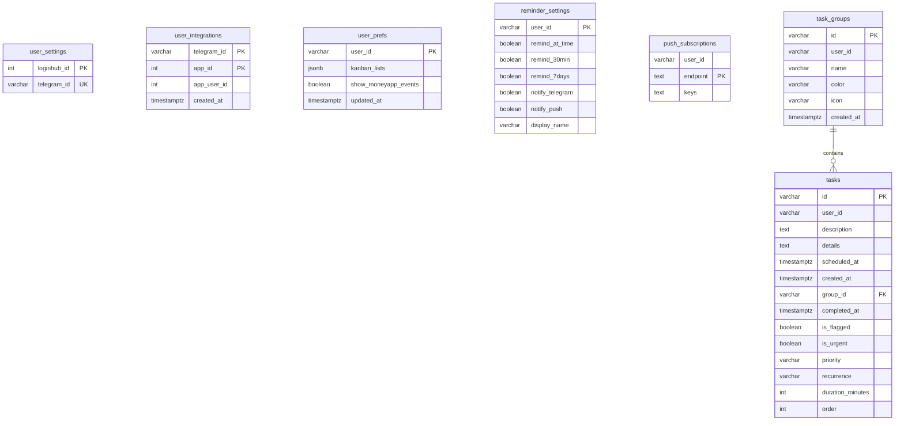

<p align="center">
  
</p>

<p align="center">
  <strong>PWA moderna de gerenciamento de tarefas pessoais</strong><br/>
  Dashboard em dark mode · Grupos · Agendamento · Flags · Urgência
</p>

<p align="center">
  
  
  
  
  
</p>

---

## 🛠️ Tech Stack

<p align="center">
  <a href="https://skillicons.dev">
    
  </a>
</p>

<table align="center">
<tr>
<td align="center"><strong>Frontend</strong></td>
<td align="center"><strong>Backend</strong></td>
<td align="center"><strong>Infra</strong></td>
</tr>
<tr>
<td align="center">
  
</td>
<td align="center">
  
</td>
<td align="center">
  
</td>
</tr>
</table>

---

## ✨ Funcionalidades

<table>
<tr>
<td width="50%">

### 📋 Tarefas
CRUD completo de tarefas com descrição, agendamento (`scheduledAt`), marcação como **concluída**, **flagged** (destaque) e **urgente**. Filtros inteligentes por: Hoje, Agendadas, Todas, Flagged, Urgentes e Concluídas. Reordenação livre de tarefas via **Drag-and-Drop**.

### 📂 Grupos
Organize suas tarefas em grupos personalizados (ex: Trabalho, Pessoal, Estudos). Cada grupo possui sua própria cor e ícone para fácil identificação, exibe a contagem de tarefas pendentes na sidebar e suporta **exclusão via modal confirmado** (sem uso do `confirm()` nativo do browser).

</td>
<td width="50%">

### 📅 Agendamento & Recorrência
Agende tarefas com data, horário de início e **fim (duração)**, e **recorrência** (diária, **dias úteis seg–sex**, semanal, mensal, anual). No calendário o bloco do evento tem altura proporcional à duração. O filtro **Hoje** mostra apenas o que precisa ser feito no dia atual. **Eventos que cruzam a meia-noite são divididos automaticamente**, renderizando os blocos em seus dias correspondentes.

### 🔐 Autenticação
Autenticação centralizada via **LoginHUB** (IDP, `app_id 4`). JWT Bearer token com auth guard em todas as rotas protegidas. Inclui fluxo inteligente para troca obrigatória de senha no primeiro acesso (`requirePasswordChange`).

</td>
</tr>
<tr>
<td width="50%">

### 🗓️ Views: Lista, Calendário e Kanban
Seletor de visualização no Dashboard. O **Calendário** (Dia/Semana/Mês, tela cheia) mostra tarefas, ocorrências de recorrência e — opcionalmente — os **lançamentos do MoneyAPP** (toggle). O **Kanban** organiza a lista selecionada em colunas por prioridade, com drag-and-drop que altera prioridade/conclui.

### 🔔 Lembretes & Web Push
Lembretes configuráveis por usuário (`no horário`, `30 min antes`, `7 dias antes`) com canais independentes: **Telegram** (via bot) e **Web Push** (VAPID + Service Worker). Rotinas diárias do bot às 08h/09h/13h. **Nome de exibição** customizável — como o bot te chama nas mensagens (fallback "Patrão").

</td>
<td width="50%">

### 🤖 Bot do Telegram
Wizards de adicionar/concluir/remover tarefas e grupos, transcrição de **voz** (Groq) e login vinculado ao LoginHub (LOGIN_WIZARD grava `user_settings.telegram_id` e migra os dados do namespace provisório).

### 🔗 Integração MoneyAPP
Lançamentos financeiros do **MoneyAPP** aparecem no calendário com o **logo do Money** (toggle "MoneyAPP"): clique abre a modal **Detalhes da Transação** (valor, categoria, status e **comprovante** — imagem/PDF via proxy), vários lançamentos no mesmo dia viram um chip **"N lançamentos"** com modal de lista e total do dia. As tarefas do TodoAPP aparecem no dashboard do Money. Ver a seção [Integração com MoneyAPP](#-integração-com-moneyapp).

</td>
</tr>
</table>

### 🎨 Destaques de UX

<p align="center">

🌙 **Dark Mode Premium** &nbsp;·&nbsp;
⚡ **Filtros Inteligentes** &nbsp;·&nbsp;
📱 **PWA Instalável** &nbsp;·&nbsp;
🎯 **Empty States com CTAs** &nbsp;·&nbsp;
✨ **Micro-animações** &nbsp;·&nbsp;
🪟 **Modais Customizados em Vue**

</p>

---

## 🏗️ Arquitetura

```
todoapp/
├── 📂 apps/
│   ├── 📂 bot/                   # Telegram Bot Worker
│   │   ├── 📂 src/
│   │   └── Dockerfile
│   ├── 📂 frontend/              # Vue 3 PWA
│   │   ├── 📂 src/
│   │   │   ├── 📂 api/           # Cliente HTTP (wrapper do api-client)
│   │   │   ├── 📂 components/    # Componentes reutilizáveis
│   │   │   │   ├── AppShell.vue          # Layout principal (sidebar + content)
│   │   │   │   ├── EmptyState.vue        # Estado vazio com CTA
│   │   │   │   └── dashboard/            # KPIs, Upcoming, etc.
│   │   │   ├── 📂 composables/   # Composables (useConfirmDialog, etc.)
│   │   │   ├── 📂 stores/        # Pinia stores
│   │   │   │   ├── auth.ts               # Autenticação + JWT
│   │   │   │   └── tasks.ts              # CRUD tarefas + filtros
│   │   │   ├── 📂 styles/        # CSS global + design tokens
│   │   │   ├── 📂 views/         # Páginas (1 por rota)
│   │   │   ├── App.vue           # Root + route transitions
│   │   │   ├── main.ts           # Entrypoint
│   │   │   └── router.ts         # Vue Router + auth guard
│   │   └── Dockerfile
│   │
│   └── 📂 backend/               # API Express
│       ├── 📂 src/
│       │   ├── 📂 middleware/     # Auth, error handler, helmet
│       │   ├── 📂 routes/        # Endpoints REST agrupados por domínio
│       │   ├── app.ts            # Express app setup
│       │   └── server.ts         # HTTP server entrypoint
│       └── Dockerfile
│
├── 📂 packages/
│   ├── 📂 api-client/            # Cliente HTTP e fetch wrappers
│   ├── 📂 db/                    # Drizzle schema + migrations + client
│   ├── 📂 models/                # Zod schemas e tipos TypeScript
│   └── 📂 services/              # Serviços core (auth, tasks)
│
├── .env                          # Variáveis de ambiente consolidadas (Backend, Frontend e Bot)
├── docker-compose.yml            # 3 serviços (backend, frontend e bot)
├── pnpm-workspace.yaml
└── tsconfig.base.json
```

### Topologia Docker



> [!NOTE]
> O PostgreSQL é um **container externo compartilhado** (`awlsrvDB_postgres`). O TodoAPP usa um **database dedicado** `todo_bot` para isolar de outras aplicações na mesma instância.

---

## 📦 Modelo de Dados



### Convenções

| Convenção | Detalhe |
| --------- | ------- |
| 🔑 PKs | `varchar(36)` (UUID gerado no app; tasks usam UUID curto de 8 chars) |
| 👤 Identidade | `user_id` das tabelas de dados = **`telegramId`** (ou `String(loginhubId)` enquanto o Telegram não é vinculado — o LOGIN_WIZARD do bot migra o namespace) |
| 🕒 Timestamps | `timestamptz` (with timezone). Lógica do server em UTC |
| 🗑️ Soft delete | **Não usado.** Hard deletes com FK cascades/set null |
| 🔁 Recorrência | `tasks.recurrence` (`daily`/`weekdays`/`weekly`/`monthly`/`yearly`/`null`); `scheduled_at` = primeira ocorrência, as demais são expandidas em runtime (frontend e bot). `weekdays` = seg–sex, nunca gera ocorrência em fim de semana |
| ⏱️ Duração | `tasks.duration_minutes` (`null` = 1h visual no calendário); definida na modal pelo horário de fim, cruza a meia-noite se fim < início |

---

## 🔌 API Endpoints

> Todos sob `/api` · Auth via `Authorization: Bearer <jwt>`

| Grupo | Método | Path | Notas |
| ----- | ------ | ---- | ----- |
| 🔐 **Auth** | `POST` | `/api/auth/login` | Proxy para o LoginHUB (`app_id 4`) · retorna `{ token }` |
| 👤 **User** | `GET`/`PATCH` | `/api/user/me` | Dados/ajustes do usuário |
| 📋 **Tasks** | `GET` | `/api/tasks` | Lista tarefas do usuário |
| | `POST` | `/api/tasks` | Cria tarefa (`createTaskSchema`: prioridade, recorrência, detalhes) |
| | `PATCH` | `/api/tasks/:id` | Atualiza (completar, flag, agendar, etc.) |
| | `DELETE` | `/api/tasks/:id` | Remove tarefa |
| | `POST` | `/api/tasks/reorder` | Reordena tarefas (drag-and-drop) |
| 📂 **Groups** | `GET` | `/api/groups` | Lista grupos do usuário |
| | `POST` | `/api/groups` | Cria grupo |
| | `PATCH` | `/api/groups/:id` | Atualiza grupo (nome, cor, ícone) |
| | `DELETE` | `/api/groups/:id` | **Remove grupo** |
| | `POST` | `/api/groups/reorder` | Reordena grupos (drag-and-drop) |
| ⚙️ **Prefs** | `GET`/`PATCH` | `/api/prefs` | `{ kanbanLists, showMoneyAppEvents }` (toggle do calendário) |
| 🔔 **Reminders** | `GET`/`PATCH` | `/api/reminders` | Configuração de lembretes (horário/30min/7dias · telegram/push · `displayName` usado pelo bot) |
| 📲 **Push** | `GET` | `/api/push/public-key` | VAPID public key |
| | `POST` | `/api/push/subscribe` | Registra subscription do Service Worker |
| | `POST` | `/api/push/unsubscribe` | Remove subscription |
| 🔗 **Integrations** | `GET` | `/api/integrations/moneyapp/calendar` | Lançamentos do MoneyAPP (`?start&end`) — ver [integração](#-integração-com-moneyapp) |
| | `GET` | `/api/integrations/moneyapp/receipt/:id` | Comprovante de um lançamento (`tx-<uuid>` ou `loan-<uuid>`) — proxy que streama imagem/PDF do Money |
| 🤖 **Bot** (interno) | `GET` | `/api/bot/tasks` | `?telegramId&start&end` · requer header `x-api-key: BOT_SERVICE_KEY` (consumido pelo MoneyAPP e pelo bot) |
| ❤️ **Health** | `GET` | `/health` | Healthcheck do container |

---

## 🚀 Quickstart

### Pré-requisitos

<p>
  
  
  
</p>

### Desenvolvimento Local

```bash
# 1️⃣  Clone o repositório
git clone https://github.com/moablive/TodoAPP.git && cd TodoAPP

# 2️⃣  Configure as variáveis de ambiente
cp .env.example .env
# Edite .env com os dados consolidados:
#   → JWT_SECRET           string aleatória de 32+ chars
#   → DATABASE_URL         connection string do PostgreSQL
#   → LOGINHUB_API_URL     URL da API do LoginHub
#   → TELEGRAM_BOT_TOKEN   Token do bot no Telegram
#   → GROQ_API_KEY         Chave de API do Groq (transcrição de voz)
#   → ALLOWED_USER_IDS     IDs do Telegram autorizados

# 3️⃣  Instale dependências
pnpm install

# 4️⃣  Gere e aplique as migrations
pnpm db:generate          # gera SQL a partir do schema Drizzle
pnpm db:migrate           # aplica no PostgreSQL

# 5️⃣  Inicie o dev server
pnpm dev                  # backend :3000 + frontend :5173
```

### Scripts Disponíveis

| Script | Descrição |
| ------ | --------- |
| `pnpm dev` | ▶️ Backend + Frontend em paralelo (hot reload) |
| `pnpm build` | 📦 Build de produção de todos os workspaces |
| `pnpm lint` | 🔍 Lint em todos os workspaces |
| `pnpm typecheck` | ✅ Verificação de tipos TypeScript |
| `pnpm db:generate` | 🗃️ Gera SQL das migrations a partir do schema |
| `pnpm db:migrate` | 🚀 Aplica migrations pendentes no banco |
| `pnpm db:studio` | 🎛️ Abre o Drizzle Studio (interface visual do DB) |

---

## 🤖 Telegram Bot — Rotina de Notificações

O bot opera 24/7 como worker e envia mensagens automáticas nos seguintes horários (fuso `America/Sao_Paulo`):

| Horário | Envio | Conteúdo |
| ------- | ----- | -------- |
| **08:00** | ☀️ Bom dia + prioridades | Só tarefas com prioridade **Alta** (urgentes) · saudação usa o **nome de exibição** de `reminder_settings.display_name` (fallback "Patrão") |
| **09:00** | 🌅 Resumo matinal completo | Todas as tarefas agrupadas por prioridade |
| **13:00** | ☀️ Resumo da tarde | Todas as tarefas agrupadas por prioridade |
| **Cada minuto** | ⏰ Lembrete pontual | Tarefas cujo `scheduledAt` (± offsets de lembrete configurados) bate com o minuto atual — respeita `reminder_settings` e envia por Telegram e/ou Web Push |

---

## 🔗 Integração com MoneyAPP

> Documentação completa (fluxos, contratos, troubleshooting): `documentacao/integracao-todoapp-moneyapp.md` no repo de docs do servidor.

A integração é **bidirecional em leitura** e toda **interna** à rede Docker `awl_network` (backend → backend, nada exposto no Cloudflare):

| Direção | Fluxo |
| ------- | ----- |
| **Money → Todo** (calendário) | `CalendarView` → `GET /api/integrations/moneyapp/calendar?start&end` → backend resolve o vínculo em `user_integrations` (`app_id 3`) → `GET http://moneyapp_backend:3000/api/calendar` com `x-api-key: BOT_SERVICE_KEY` + `x-user-id: <loginhub_id do usuário NO Money>` |
| **Money → Todo** (comprovante) | Botão "Ver Comprovante" na modal de detalhes → `GET /api/integrations/moneyapp/receipt/:id` (`tx-*`/`loan-*`) → proxy para `GET /api/transactions/:uuid/receipt` ou `/api/loans/:uuid/receipt` do Money → streama a imagem/PDF |
| **Todo → Money** (dashboard) | O backend do MoneyAPP chama `GET /api/bot/tasks?telegramId&start&end` (protegido por `x-api-key`) e exibe as tarefas em "Próximos Lançamentos" |

**Pontos-chave:**

- ⚠️ O `loginhub_id` é **por app** (TodoAPP = app 4, MoneyAPP = app 3): o mesmo e-mail tem IDs diferentes em cada app. A chave de junção entre os apps é o **`telegramId`**, mapeado na tabela `user_integrations (telegram_id, app_id, app_user_id)`.
- O vínculo em `user_integrations` é **manual** (SQL) por enquanto — não há UI/endpoint de escrita.
- `BOT_SERVICE_KEY` deve ser **idêntico** nos `.env` do TodoAPP e do MoneyAPP.
- Contrato do `/api/calendar` do Money: itens `{ id, title, date, amount, type, status, category, color, hasReceipt }` (atenção: `title`/`color`, não `description`/`categoryColor`; `id` prefixado `tx-`/`loan-`).
- Toggle do usuário: `user_prefs.show_moneyapp_events` (via `PATCH /api/prefs`), botão "MoneyAPP" no header do calendário. Falha do Money não quebra o calendário — retorna lista vazia.
- **UI no calendário**: eventos do Money exibem o logo (`/moneyapp-logo.png`); clique abre a modal "Detalhes da Transação" (valor, data, categoria, status, comprovante). Vários lançamentos no mesmo dia são agrupados num chip **"N lançamentos"** que abre a lista do dia com total. Sábado/domingo têm fundo vermelho fraco (dias não úteis).

---

## 🐳 Deploy com Docker

O projeto roda como **3 containers** conectados a um PostgreSQL externo na rede `awl_network`.

```bash
# Garanta que a rede Docker existe
docker network inspect awl_network >/dev/null 2>&1 || docker network create awl_network

# Build e deploy
docker compose --env-file .env up -d --build

# Pós-Deploy: Limpar cache do Cloudflare
awldocs-run cleancachecloudflare.sh   # o script vive no awldocs, nao mais em disco
```

| Container | Base | Porta | Função |
| --------- | ---- | ----- | ------ |
| `lbs_todoapp_backend` | Node 20 | `3000` (interno) | API REST + healthcheck |
| `lbs_todoapp_frontend` | nginx | `80` (interno) | Static assets + reverse proxy `/api/` → backend |
| `lbs_todoapp_bot` | Node 20 | `-` | Telegram Bot Worker |

> [!IMPORTANT]
> **Ingress em produção**: O tráfego chega via **Cloudflare Tunnel** diretamente ao `lbs_todoapp_frontend:80` dentro da `awl_network`. Nenhuma porta é exposta ao host.

---

## 🗃️ Migrations — regras que o histórico ensinou

O diretório `packages/db/drizzle/` começa em `0000_baseline.sql` (27/08/2026),
gerado do schema e **validado contra a produção**: 85 colunas idênticas. As 29
migrations anteriores estão em `packages/db/drizzle_arquivo/`, com o
`LEIA-ME.md` explicando por que saíram.

A cadeia antiga **não reconstruía o banco**: num banco vazio falhava com
`relation "user_settings" does not exist` — a tabela existia em produção sem
nunca ter sido criada por migration. O mesmo defeito estava nos três apps da
suite que usam Drizzle.

Aqui a comparação revelou mais do que nos outros dois: o schema TS divergia da
produção em cinco pontos, e **o código foi alinhado ao banco**, não o contrário.

> ⚠️ **Apagar um grupo apaga as tarefas dele** — `ON DELETE CASCADE` no
> `tasks.group_id`. É o comportamento real desde sempre; o schema dizia
> `SET NULL` e ninguém percebeu. Mudar isso é decisão de produto, com migration
> própria.

**As três regras:**

1. **Migration aplicada não se edita.** `pnpm db:generate` cria a próxima.
2. **Limpeza de dados pontual não é migration.** Vai para script avulso.
3. **Schema não se altera à mão no psql.** Foi assim que `user_settings`, o
   índice `tasks_calendar_uid_uidx` e uma constraint UNIQUE duplicada passaram a
   existir sem o repositório saber.

---

## 🔥 Hot reload (modo dev)

Em produção o front é build estático servido por nginx e o backend roda o
código compilado — editar arquivo não muda nada até republicar. Para
desenvolver existe o `docker-compose.dev.yml`, que **não** é usado por
`docker compose up -d` sozinho nem pelo `redeploy.sh`:

```bash
pnpm docker:dev     # docker compose -f docker-compose.yml -f docker-compose.dev.yml up
```

Editou no host, o container reage: `tsx watch` reinicia o backend em ~1 s, e o
Vite troca o módulo no navegador sem recarregar a página.

| Serviço | Onde responde em dev |
|---|---|
| Frontend (Vite) | `http://<host>:5184` |
| Backend (direto) | `http://<host>:5084` |

### O que o override troca

- **Estágio da imagem**: em vez da imagem final (nginx / runtime enxuto), sobe o
  estágio `deps`, que tem as dependências instaladas e **não** tem o código — o
  código vem do bind mount.
- **Comando**: `pnpm ... dev` no lugar do `nginx`/`pnpm start`.
- **Volumes**: a raiz do repositório vai para dentro do container, e cada
  `node_modules` ganha um **volume anônimo** que o protege. Sem isso o
  `node_modules` do host cobriria o do container — e o do host foi resolvido
  para outra plataforma, então o Vite morre no boot. **Workspace novo em
  `apps/` ou `packages/` exige linha nova na âncora `x-hot-reload`.**
- **Imagem com nome próprio** (sufixo `-dev`): sem isso o compose reaproveita a
  imagem de produção já tagueada com o mesmo nome, ignora o `target:` e o
  container sobe com o nginx, morrendo em `pnpm: not found`.
- **Proxy `/api`**: em produção quem encaminha é o nginx; em dev ele sai do
  caminho e quem assume é o próprio Vite, via `DEV_API_TARGET`.

### Quando ainda é preciso rebuildar

O hot reload cobre **código**. Mudança em `package.json` (dependências),
`Dockerfile`, `.env` ou no próprio compose exige recriar:

```bash
docker compose ... down -v && docker compose ... up -d --build
```

O `-v` não é opcional: `--build` reconstrói a imagem, mas o **volume anônimo
sobrevive com o `node_modules` antigo** e continua sendo montado por cima.

---

## 🏷️ Versionamento e aviso de nova versão

Toda publicação incrementa a versão e a mostra no app. Serve para duas coisas:
saber de fora qual build está no ar, e avisar quem está com o app aberto que
saiu build novo — quem instala na tela inicial fica semanas sem recarregar de
verdade, rodando código antigo sem saber.

### O fluxo

```
VERSION (0.0.1)                       ← fonte da verdade, versionada no git
   │  node scripts/bump-version.mjs
   ▼
0.0.2 + APP_BUILD_DATE
   │
   └─▶ .env  (APP_VERSION, APP_BUILD_DATE)   ← lido pelo --env-file do deploy
              │
              ├─▶ backend  APP_VERSION       → GET /health
              └─▶ frontend VITE_APP_VERSION  → build-arg, congelado no bundle
                             │
                             ▼
                   useVersionCheck compara os dois
                             │  divergiu?
                             ▼
                   UpdateBanner: "Nova versão disponível"
```

### Comandos

| Comando | Efeito |
|---|---|
| `node scripts/bump-version.mjs` | `0.0.1` → `0.0.2` (patch) |
| `node scripts/bump-version.mjs --minor` | `0.0.9` → `0.1.0` |
| `node scripts/bump-version.mjs --major` | `0.1.4` → `1.0.0` |
| `node scripts/bump-version.mjs --set 2.5.0` | define manualmente |

O `VERSION` é a fonte da verdade e é versionado; o `.env` é espelho gerado —
**não edite `APP_VERSION` à mão.** Depois do bump, republique normalmente
(`redeploy.sh`, que já roda com `--build`): é o rebuild que carrega a versão
nova para dentro do bundle do front.

### Onde aparece

| Onde | O quê |
|---|---|
| `GET /health` | `{ version, buildDate }` — público, é o que o front consulta |
| Canto inferior direito | badge `v0.0.2`; o *tooltip* mostra a data do build |
| Banner, quando diverge | "Nova versão disponível" com **Depois** / **Atualizar agora** |

### Como funciona por dentro

- `apps/frontend/src/composables/useVersionCheck.ts` pergunta ao `/health` a
  cada 5 min (só com a aba visível) e ao voltar o foco para o app — que é o
  momento mais provável de haver deploy esperando. Usa `fetch` puro: o cliente
  HTTP do app derruba a sessão em qualquer 401, e uma checagem de fundo não pode
  ter esse poder.
- **O aviso é uma sugestão, não um reload automático.** Recarregar sozinho
  jogaria fora formulário meio preenchido; quem decide é o usuário.
- O `nginx.conf` do front encaminha `/health` ao backend de propósito. Sem essa
  `location`, o caminho cairia no *SPA fallback* e devolveria o `index.html` —
  JSON esperado, HTML recebido, e o banner nunca apareceria.
- Sem `APP_VERSION` no ambiente (dev local), a checagem se desliga sozinha: sem
  baseline, toda comparação seria falso positivo.

---

## 🔐 Autenticação & Segurança

| Aspecto | Implementação |
| ------- | ------------- |
| **Identidade** | Centralizada no LoginHUB (IDP, `app_id 4`) |
| **Tokens** | JWT Bearer emitido pelo LoginHUB, verificado via `JWT_SECRET` compartilhado |
| **userId** | Extraído **apenas** de `req.user` (payload JWT) — nunca do body/query. O middleware `resolveTelegramId` converte `loginhubId` → `telegramId` (chave real dos dados) |
| **Identidade delegada** | Serviços internos (bot do Telegram, backend do MoneyAPP) autenticam com `x-api-key: BOT_SERVICE_KEY` (+ `x-user-id` quando agem em nome de um usuário) |
| **Segurança HTTP** | Helmet (headers), CORS configurável via env |

---

## 🗺️ Rotas do Frontend

| Rota | View | Descrição |
| ---- | ---- | --------- |
| `/login` | `LoginView` | 🔐 Autenticação (rota pública) |
| `/` | `DashboardView` | 📋 Dashboard com tarefas, grupos e filtros |

---

## ☁️ Configuração Cloudflare Tunnel

Para expor o TodoAPP via Cloudflare Tunnel, adicione a seguinte entrada na configuração do tunnel:

| Campo | Valor |
| ----- | ----- |
| **Subdomain** | `todo` (ou o desejado) |
| **Domain** | `astralwavelabel.com` |
| **URL completa** | `todo.astralwavelabel.com` |
| **Service** | `http://lbs_todoapp_frontend:80` |
| **Type** | `HTTP` |

---

<p align="center">
  <sub>Feito com ☕ por <strong>Moab</strong></sub><br/>
  <sub>Projeto privado — uso pessoal</sub>
</p>
