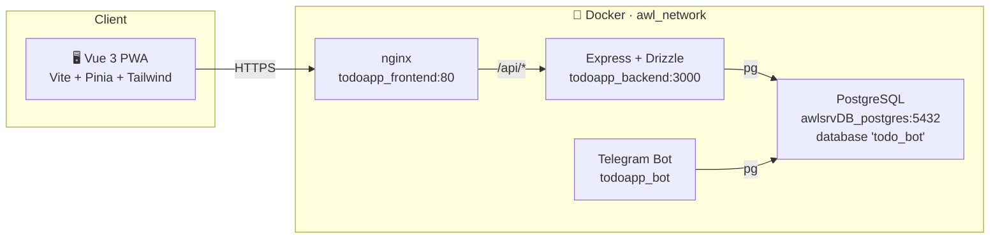
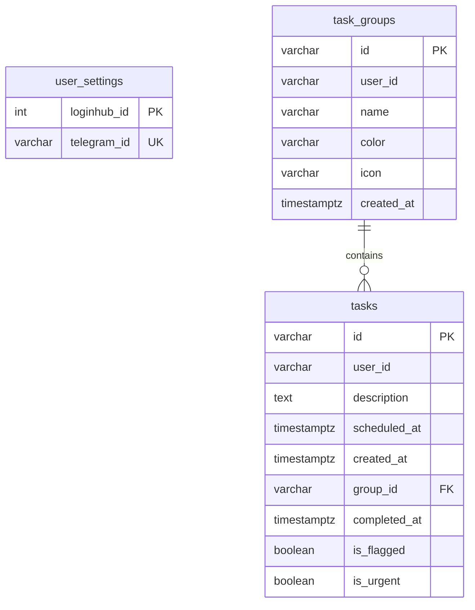

<p align="center">
  
</p>

<p align="center">
  <strong>PWA moderna de gerenciamento de tarefas pessoais</strong><br/>
  Dashboard em dark mode · Grupos · Agendamento · Flags · Urgência
</p>

<p align="center">
  
  
  
  
  
</p>

---

## 🛠️ Tech Stack

<p align="center">
  <a href="https://skillicons.dev">
    
  </a>
</p>

<table align="center">
<tr>
<td align="center"><strong>Frontend</strong></td>
<td align="center"><strong>Backend</strong></td>
<td align="center"><strong>Infra</strong></td>
</tr>
<tr>
<td align="center">
  
</td>
<td align="center">
  
</td>
<td align="center">
  
</td>
</tr>
</table>

---

## ✨ Funcionalidades

<table>
<tr>
<td width="50%">

### 📋 Tarefas
CRUD completo de tarefas com descrição, agendamento (`scheduledAt`), marcação como **concluída**, **flagged** (destaque) e **urgente**. Filtros inteligentes por: Hoje, Agendadas, Todas, Flagged, Urgentes e Concluídas. Reordenação livre de tarefas via **Drag-and-Drop**.

### 📂 Grupos
Organize suas tarefas em grupos personalizados (ex: Trabalho, Pessoal, Estudos). Cada grupo possui sua própria cor e ícone para fácil identificação, exibe a contagem de tarefas pendentes na sidebar e suporta **exclusão via modal confirmado** (sem uso do `confirm()` nativo do browser).

</td>
<td width="50%">

### 📅 Agendamento
Agende tarefas para datas e horários específicos utilizando uma interface de Modal amigável com calendário e seletor de horas. O filtro **Hoje** mostra apenas o que precisa ser feito no dia atual.

### 🔐 Autenticação
Autenticação centralizada via **LoginHUB** (IDP). JWT Bearer token com auth guard em todas as rotas protegidas. Inclui fluxo inteligente para troca obrigatória de senha no primeiro acesso (`requirePasswordChange`).

</td>
</tr>
</table>

### 🎨 Destaques de UX

<p align="center">

🌙 **Dark Mode Premium** &nbsp;·&nbsp;
⚡ **Filtros Inteligentes** &nbsp;·&nbsp;
📱 **PWA Instalável** &nbsp;·&nbsp;
🎯 **Empty States com CTAs** &nbsp;·&nbsp;
✨ **Micro-animações** &nbsp;·&nbsp;
🪟 **Modais Customizados em Vue**

</p>

---

## 🏗️ Arquitetura

```
todoapp/
├── 📂 apps/
│   ├── 📂 bot/                   # Telegram Bot Worker
│   │   ├── 📂 src/
│   │   └── Dockerfile
│   ├── 📂 frontend/              # Vue 3 PWA
│   │   ├── 📂 src/
│   │   │   ├── 📂 api/           # Cliente HTTP (wrapper do api-client)
│   │   │   ├── 📂 components/    # Componentes reutilizáveis
│   │   │   │   ├── AppShell.vue          # Layout principal (sidebar + content)
│   │   │   │   ├── EmptyState.vue        # Estado vazio com CTA
│   │   │   │   └── dashboard/            # KPIs, Upcoming, etc.
│   │   │   ├── 📂 composables/   # Composables (useConfirmDialog, etc.)
│   │   │   ├── 📂 stores/        # Pinia stores
│   │   │   │   ├── auth.ts               # Autenticação + JWT
│   │   │   │   └── tasks.ts              # CRUD tarefas + filtros
│   │   │   ├── 📂 styles/        # CSS global + design tokens
│   │   │   ├── 📂 views/         # Páginas (1 por rota)
│   │   │   ├── App.vue           # Root + route transitions
│   │   │   ├── main.ts           # Entrypoint
│   │   │   └── router.ts         # Vue Router + auth guard
│   │   └── Dockerfile
│   │
│   └── 📂 backend/               # API Express
│       ├── 📂 src/
│       │   ├── 📂 middleware/     # Auth, error handler, helmet
│       │   ├── 📂 routes/        # Endpoints REST agrupados por domínio
│       │   ├── app.ts            # Express app setup
│       │   └── server.ts         # HTTP server entrypoint
│       └── Dockerfile
│
├── 📂 packages/
│   ├── 📂 api-client/            # Cliente HTTP e fetch wrappers
│   ├── 📂 db/                    # Drizzle schema + migrations + client
│   ├── 📂 models/                # Zod schemas e tipos TypeScript
│   └── 📂 services/              # Serviços core (auth, tasks)
│
├── .env                          # Variáveis de ambiente consolidadas (Backend, Frontend e Bot)
├── docker-compose.yml            # 3 serviços (backend, frontend e bot)
├── pnpm-workspace.yaml
└── tsconfig.base.json
```

### Topologia Docker



> [!NOTE]
> O PostgreSQL é um **container externo compartilhado** (`awlsrvDB_postgres`). O TodoAPP usa um **database dedicado** `todo_bot` para isolar de outras aplicações na mesma instância.

---

## 📦 Modelo de Dados



### Convenções

| Convenção | Detalhe |
| --------- | ------- |
| 🔑 PKs | `varchar(36)` (UUID gerado no app) |
| 🕒 Timestamps | `timestamptz` (with timezone). Lógica do server em UTC |
| 🗑️ Soft delete | **Não usado.** Hard deletes com FK cascades/set null |

---

## 🔌 API Endpoints

> Todos sob `/api` · Auth via `Authorization: Bearer <jwt>`

| Grupo | Método | Path | Notas |
| ----- | ------ | ---- | ----- |
| 🔐 **Auth** | `POST` | `/api/auth/login` | Retorna `{ token }` via LoginHUB |
| 📋 **Tasks** | `GET` | `/api/tasks` | Lista tarefas do usuário |
| | `POST` | `/api/tasks` | Cria tarefa |
| | `PATCH` | `/api/tasks/:id` | Atualiza (completar, flag, etc.) |
| | `DELETE` | `/api/tasks/:id` | Remove tarefa |
| | `POST` | `/api/tasks/reorder` | Reordena tarefas (drag-and-drop) |
| 📂 **Groups** | `GET` | `/api/groups` | Lista grupos do usuário |
| | `POST` | `/api/groups` | Cria grupo |
| | `PATCH` | `/api/groups/:id` | Atualiza grupo (nome, cor, ícone) |
| | `DELETE` | `/api/groups/:id` | **Remove grupo** |
| | `POST` | `/api/groups/reorder` | Reordena grupos (drag-and-drop) |
| ❤️ **Health** | `GET` | `/health` | Healthcheck do container |

---

## 🚀 Quickstart

### Pré-requisitos

<p>
  
  
  
</p>

### Desenvolvimento Local

```bash
# 1️⃣  Clone o repositório
git clone https://github.com/moablive/TodoAPP.git && cd TodoAPP

# 2️⃣  Configure as variáveis de ambiente
cp .env.example .env
# Edite .env com os dados consolidados:
#   → JWT_SECRET           string aleatória de 32+ chars
#   → DATABASE_URL         connection string do PostgreSQL
#   → LOGINHUB_API_URL     URL da API do LoginHub
#   → TELEGRAM_BOT_TOKEN   Token do bot no Telegram
#   → GROQ_API_KEY         Chave de API do Groq (transcrição de voz)
#   → ALLOWED_USER_IDS     IDs do Telegram autorizados

# 3️⃣  Instale dependências
pnpm install

# 4️⃣  Gere e aplique as migrations
pnpm db:generate          # gera SQL a partir do schema Drizzle
pnpm db:migrate           # aplica no PostgreSQL

# 5️⃣  Inicie o dev server
pnpm dev                  # backend :3000 + frontend :5173
```

### Scripts Disponíveis

| Script | Descrição |
| ------ | --------- |
| `pnpm dev` | ▶️ Backend + Frontend em paralelo (hot reload) |
| `pnpm build` | 📦 Build de produção de todos os workspaces |
| `pnpm lint` | 🔍 Lint em todos os workspaces |
| `pnpm typecheck` | ✅ Verificação de tipos TypeScript |
| `pnpm db:generate` | 🗃️ Gera SQL das migrations a partir do schema |
| `pnpm db:migrate` | 🚀 Aplica migrations pendentes no banco |
| `pnpm db:studio` | 🎛️ Abre o Drizzle Studio (interface visual do DB) |

---

## 🤖 Telegram Bot — Rotina de Notificações

O bot opera 24/7 como worker e envia mensagens automáticas nos seguintes horários (fuso `America/Sao_Paulo`):

| Horário | Envio | Conteúdo |
| ------- | ----- | -------- |
| **08:00** | ☀️ Bom dia + prioridades | Só tarefas com prioridade **Alta** (urgentes) |
| **09:00** | 🌅 Resumo matinal completo | Todas as tarefas agrupadas por prioridade |
| **13:00** | ☀️ Resumo da tarde | Todas as tarefas agrupadas por prioridade |
| **Cada minuto** | ⏰ Lembrete pontual | Tarefas cujo `scheduledAt` bate com o minuto atual |

---

## 🐳 Deploy com Docker

O projeto roda como **3 containers** conectados a um PostgreSQL externo na rede `awl_network`.

```bash
# Garanta que a rede Docker existe
docker network inspect awl_network >/dev/null 2>&1 || docker network create awl_network

# Build e deploy
docker compose --env-file .env up -d --build
```

| Container | Base | Porta | Função |
| --------- | ---- | ----- | ------ |
| `app_todoapp_backend` | Node 20 | `3000` (interno) | API REST + healthcheck |
| `app_todoapp_frontend` | nginx | `80` (interno) | Static assets + reverse proxy `/api/` → backend |
| `app_todoapp_bot` | Node 20 | `-` | Telegram Bot Worker |

> [!IMPORTANT]
> **Ingress em produção**: O tráfego chega via **Cloudflare Tunnel** diretamente ao `app_todoapp_frontend:80` dentro da `awl_network`. Nenhuma porta é exposta ao host.

---

## 🔐 Autenticação & Segurança

| Aspecto | Implementação |
| ------- | ------------- |
| **Identidade** | Centralizada no LoginHUB (IDP) |
| **Tokens** | JWT Bearer emitido pelo LoginHUB, verificado via `JWT_SECRET` compartilhado |
| **userId** | Extraído **apenas** de `req.user` (payload JWT) — nunca do body/query |
| **Segurança HTTP** | Helmet (headers), CORS configurável via env |

---

## 🗺️ Rotas do Frontend

| Rota | View | Descrição |
| ---- | ---- | --------- |
| `/login` | `LoginView` | 🔐 Autenticação (rota pública) |
| `/` | `DashboardView` | 📋 Dashboard com tarefas, grupos e filtros |

---

## ☁️ Configuração Cloudflare Tunnel

Para expor o TodoAPP via Cloudflare Tunnel, adicione a seguinte entrada na configuração do tunnel:

| Campo | Valor |
| ----- | ----- |
| **Subdomain** | `todo` (ou o desejado) |
| **Domain** | `astralwavelabel.com` |
| **URL completa** | `todo.astralwavelabel.com` |
| **Service** | `http://app_todoapp_frontend:80` |
| **Type** | `HTTP` |

---

<p align="center">
  <sub>Feito com ☕ por <strong>Guilherme Bonato</strong></sub><br/>
  <sub>Projeto privado — uso pessoal</sub>
</p>
